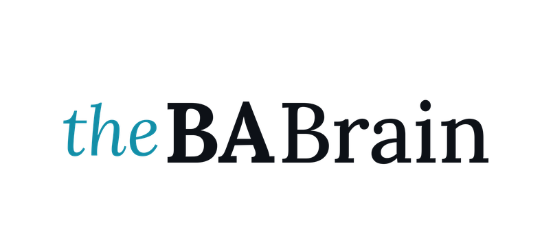

  <picture>
    <source media="(prefers-color-scheme: dark)" srcset="assets/logo-dark-mode.png">
    
  </picture>

# theBABrain

An open-source second brain for business analysts.

theBABrain exists to support business analysts in owning the value they create, not just the notes they take.

## Status

In active development, building in the open. The framework and demo data are landing here as they're built, not all at once. Follow along or star the repo to catch the updates as they come.

## What it will be

A BA-specific layer on top of a general "brain" pattern: markdown files as memory, model-agnostic — works with whatever AI you already use. Built from 18 years training, mentoring, and consulting business analysts, not theory.

## License

MIT — see [LICENSE](LICENSE). Free and open source, always.

## Author

Built by [Agnieszka Balcerzak](https://www.linkedin.com/in/balcerzakagnieszka/) — business analysis trainer, mentor & consultant.

More at [thebabrain.ai](https://www.thebabrain.ai) · [LinkedIn](https://www.linkedin.com/company/thebabrain/)
